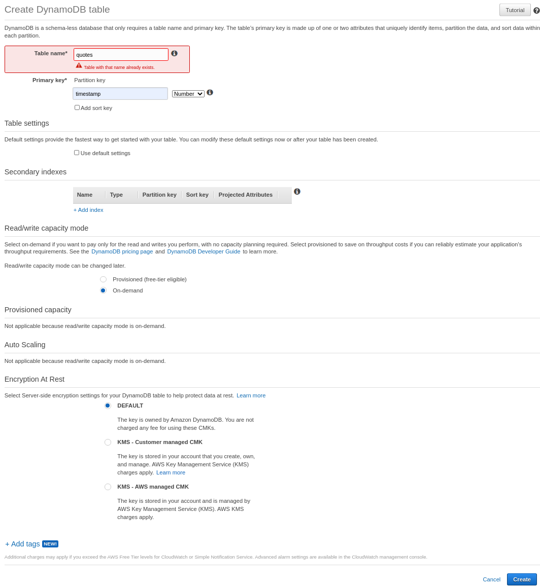
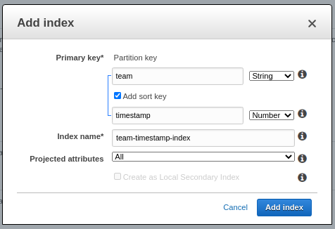
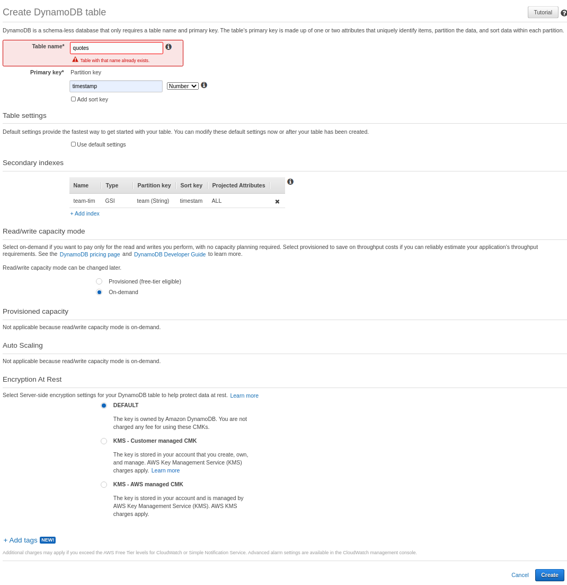
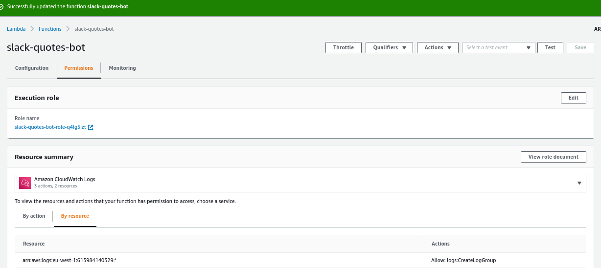
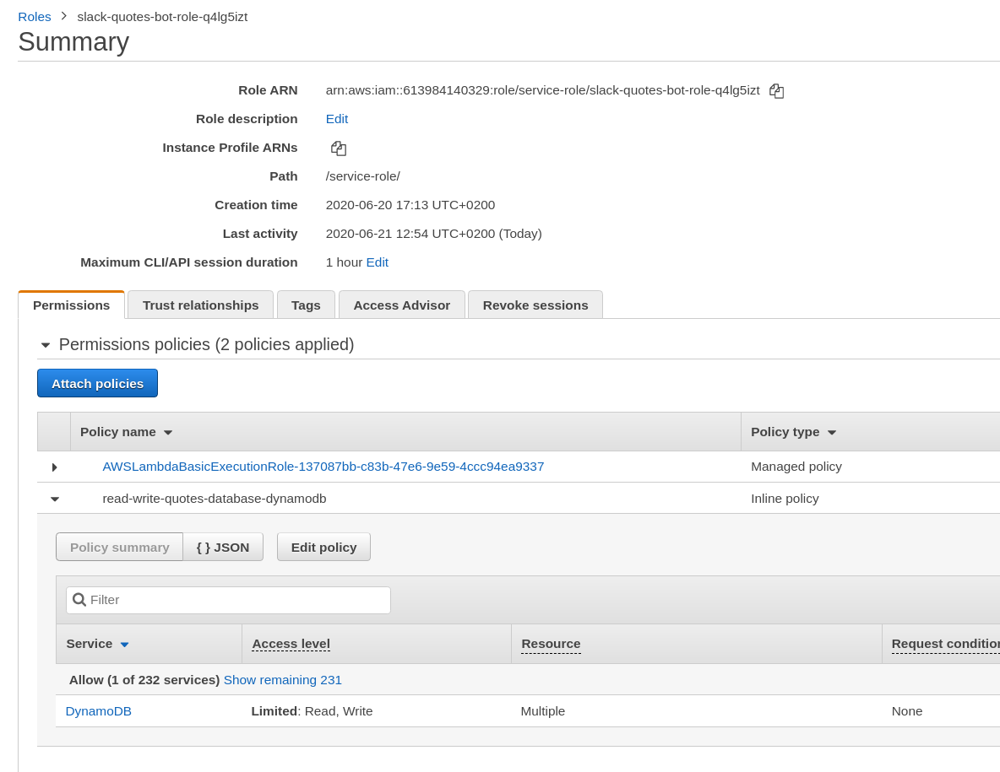
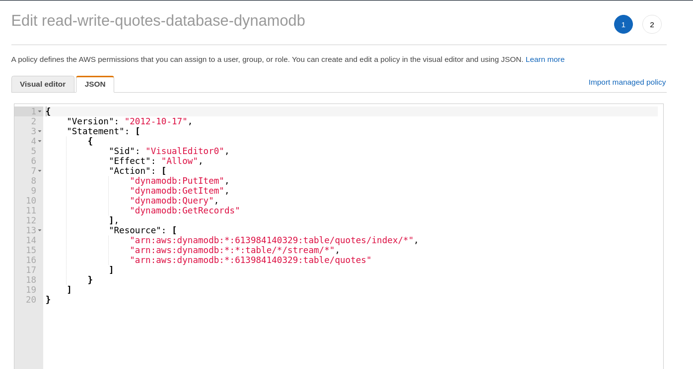
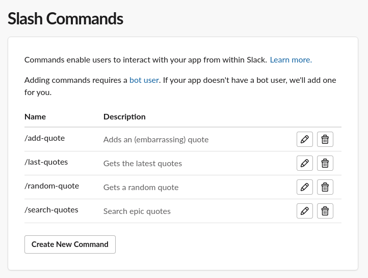

Serverless Slack Quote Bot
===

This is a minimalistic, single-file, serverless Quote Bot for Slack, based on this starting point: https://github.com/jtwaleson/minimalistic-serverless-slack-app .

It was created in June 2020.

Project goals
---

- Provide a Slack Quote Bot to store the legendary, embarrassing, funny sayings of your coworkers.

Technologies used
---

Shared with https://github.com/jtwaleson/minimalistic-serverless-slack-app:

- AWS API Gateway
- AWS Lambda
- Python 3.8
- Slack App

Additional:

- AWS DynamoDB

Design goals
---

- Simplicity (single file, no Layers in Lambda, no dependencies)
- Cheap to run, it should only cost a couple of cents per month
- Secure
- Cloud-only. You can not run this program locally. No Flask, no Gunicorn, no WSGI etc. Just a plain Lambda handler.

Included functionality
---

Slack Slash Commands:
- `/add-quote`
- `/last-quotes`
- `/random-quote`
- `/search-quotes`

Setting it up
===

Start by setting up the basic infrastructure from https://github.com/jtwaleson/minimalistic-serverless-slack-app via the README there. This should take about 10 minutes. Throughout the process, use a better name for your Slack App, like `Quotes Bot`

Then we'll follow these steps:

1. Create the DynamoDB table and Index
2. Give your Lambda IAM Role access to the DynamoDB table
3. Change the code to include the new slash commands
4. Add the Slash commands in Slack

Here we go!

Step 1 - Create the DynamoDB table and Index
---

Go to DynamoDB in the AWS Console and create a new DynamoDB table. Use the following settings but do not click Create yet! (Note: quotes already existed in my account, but it will probably not exist in your account yet).

Before clicking Create, add a Secondary Index like so:

Note the name of the index, you will need this in the code later. The code defaults to `team-timestamp-index`. Back on the overview, it should now look like this:

Step 2 - Give your Lambda IAM Role access to the DynamoDB table
---

Go to the Lambda console, click Permissions and open the Role definition.

This brings you to the IAM console. Attach an `inline policy` to the role.

When you edit the policy, make sure the json output looks like this:

That's it! It might take a couple of minutes before the permissions take effect.

Step 3 - Change the code to include the new slash commands
---

Go back to the Lambda console, and in the lambda function code editor, copy the files from the `src` directory in this repository rather than the code from Minimalistic Serverless Slack App. Save.

Also check out the `deploy.sh` executable to streamline code updates.

Step 4 - Add the Slash commands in Slack
---
Go to the Slack App management interface and add the following slash commands. All commands should have the Request URL pointing to the same API Gateway Endpoint.

That's it! Quote away.
